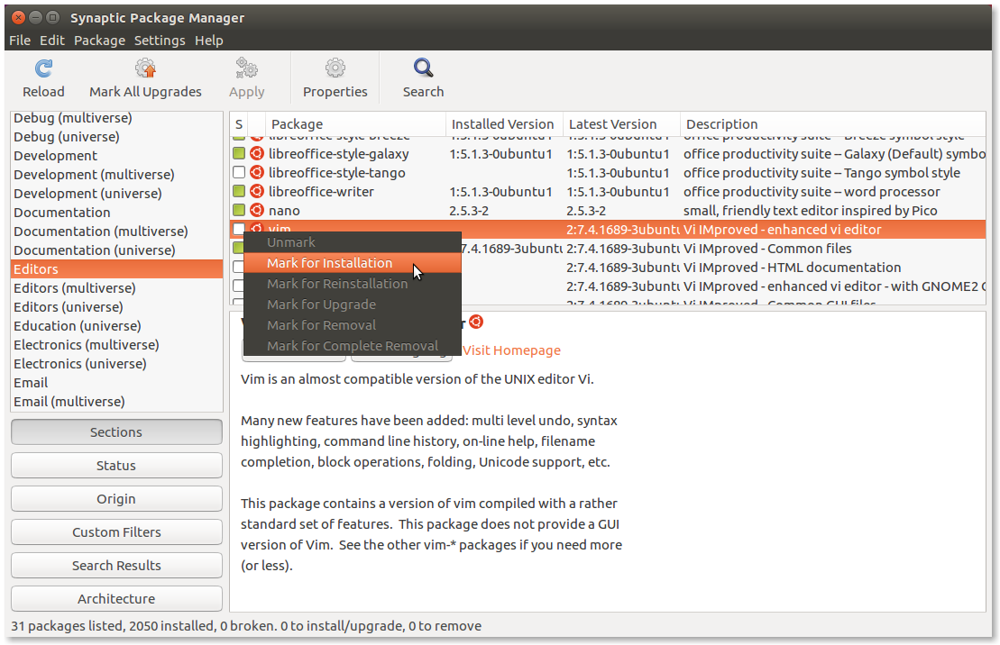
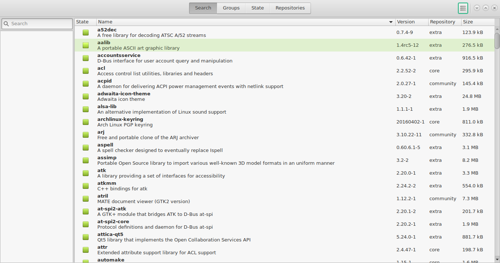

In this post, we will see installation methods used in Linux distributions

<!--more-->

When you use Linux, there are be different methods of software installation.
Some of the methods I will try to cover in this post
Before we learn about the package managers, let's see what they do for us

+ Package managers help us to install, uninstall Linux software from the trusted repositories
+ They also help us to fetch dependencies required to install the current package to install in a single command
+ They help to standardise the locations and configuration files at a fixed location decided by the Linux distribution

### Using package managers

We have something called `Debian Package Management System` which is base for most of the Debian based Linux distributions systems.
Under this, we use different package managers

### Apt (Advanced packaging tool)

Some of the commands and its usage are as follows

|Command|Usage|
|:---|---|
|`sudo apt update`|Update package database  |
|`sudo apt upgrade`|Upgrade all system packages|
|`sudo apt update &&  sudo apt upgrade -y`|Update and Upgrade in single command |
|`sudo apt install <package_name`|Install specifid package|
|`sudo apt remove`|Remove package |
|`sudo apt purge`|Removes package including its the configuration files|
|`sudo apt search <search term>``|Search for package information in package database|
|`sudo apt show <package_name>``|Shows the contents of the package |
|`sudo apt list --upgradeable`|Shows all packages for which updates are available |
|`sudo apt list --installed`|Shows list of installed packages|
|`sudo apt autoremove`|Remove useless packages which got installed with other softwares but now not needed |

### Aptitude Package Manager this works similar like apt package manager

|Command|Usage|
|:---|---|
| `aptitude install <package_name>` |Install <package_name> |
| `aptitude search <package_name>`  |Search <package_name> |
| `aptitude search ~i`   |List installed packages |
| `aptitude remove <package_name>`  |Remove <package_name> |
| `aptitude search ~D<package_name>` |List reverse dependencies |
| `aptitude versions <package_name>`|Print information on priorities for <package_name> |
| `aptitude show <package_name>` |Show package information for <package_name> |
| `aptitude source <package_name>` |Download <package_name>'s sources  |

3. Using dpkg tool

### Next comes RPM (Red Hat Package Manager)

Here we have YUM (Yellowdog Updater, Modified) which is now updated with DNF – Dandified Yum

|Command|Usage|
|:---|---|
|`dnf install <pkg>`|Install package|
|`dnf install httpd-manual -y`|While doing installation it assumes Yes|
|`dnf check-update`| Check for Updates |
|`dnf update <pkg> -y`|Updates pkg |
|`dnf download <pkg>`|Download RMP package|
|`dnf install pkg.rpm`|Install local package|
| `dnf remove pkg`|Uninstall package |
|`dnf reinstall pkg -y`|Reinstall package|
|`dnf repolist`|View the repository informinstallationation|
|`dnf search pkg`|Search for specific package information|
|` dnf info pkg`|See package information|
|`dnf history`|VIew the history of the dnf commands /transcations |
|`dnf clean all`|Clear Cached  Information|

#### Pacman Package Manager  Arch Linux
pacman is used in arch based distributions like manjaro linux

**Common Commands**

|Command|Usage|
|:---|---|
| `pacman -Syu <pkg>`	|Install (and update package list)|
| `pacman -S <pkg>`	|Install only|
| `pacman -Rsc <pkg>`|	Uninstall|
| `pacman -Ss <keywords>`|	Search|
| `pacman -Syu`	|Upgrade everything|
installation
**Query**

|Command|Usage|
|:---|---|
| `pacman -Qe `|List explictly-installed packages|
| `pacman -Ql `|<pkg>	What files does this package have?|
| `pacman -Qii`| <pkg>	List information on package|
| `pacman -Qo `|<file>	Who owns this file?|
| `pacman -Qs `| <query>	Search installed packages for keywords|

**Orphans**

|Command|Usage|
|:---|---|
|`pacman -Qdt`|	List unneeded packages|
|`pacman -Rns $(pacman -Qdtq)`|	Uninstall unneeded packages|

**Other**

|Command|Usage|
|:---|---|
|`pactree <pkg>`   | 	What does pkg depend on?
|`pactree -r <pkg>` |	What depends on pkg?

If you dont like to work with commands, there are also the Graphical Package Managers as shown below

### Ubuntu Software Center

### Fedora Software center

### Synaptic Package Manager

### Pamac Manager

