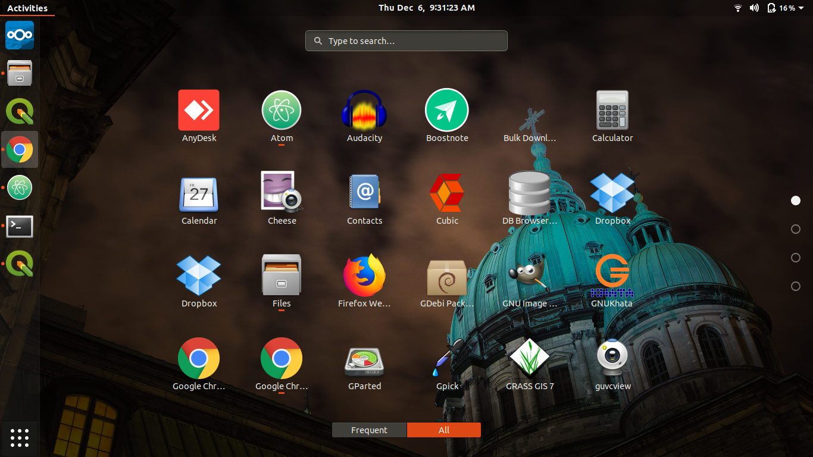

In this post, we will explore various Linux desktop environments
<!--more-->

Linux desktop is nothing but the graphical user interface for the Linux OS.

Every Linux distributions has GUI environment, examples Ubuntu has modified GNOME desktop, Fedora has GNOME. Some Linux distributions don't have any default GUI like Arch Linux, you can use any desktop.

Even if you get the default desktop environment you can install any and use. You can select whichever desktop you want once your computer is started.

So how this desktop environment differs from one another.
+ The user interface is different
+ Default icons, File Explorer is different
+ Implementation language of these environment differs
+ Some desktop environments are lighter and some are heavy animations

Below we will see some of the famous Linux desktop environments

### [GNOME on Ubuntu 18.04](https://www.gnome.org/gnome-3/)

### [KDE Plasma Desktop](https://www.kde.org/)

### [Cinnamon Desktop used on Linux Mint](https://linuxmint.com/)

### [XFCE Desktop] (https://www.xfce.org/)

### [Pantheon : Used by Elementry OS](https://elementary.io/)

