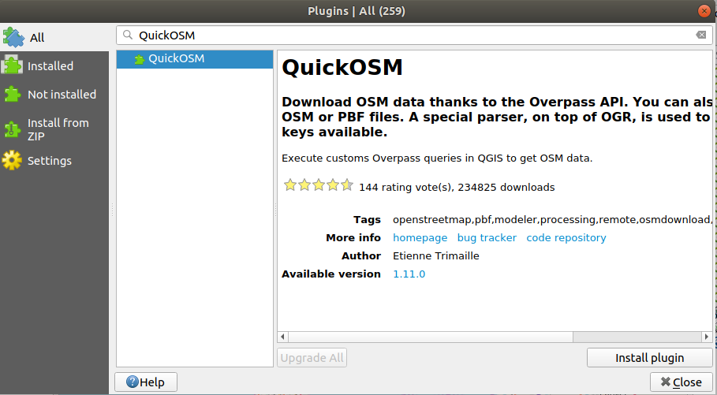
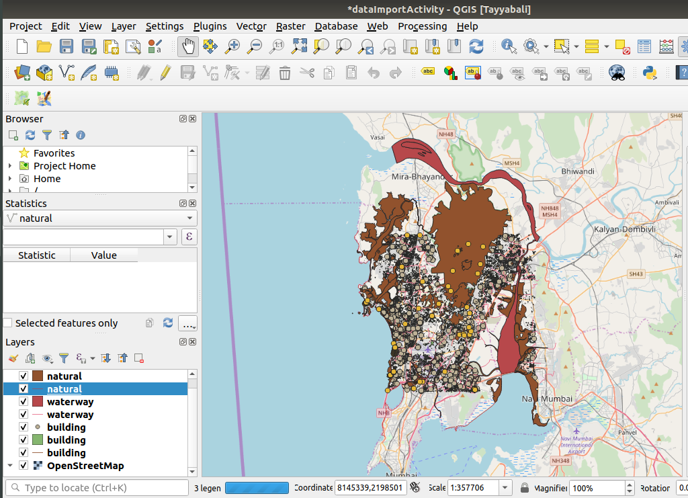

#### In this post we will learn to create our own data using Open Street Map

#### Steps

1. Open QGIS
2. Create a new Project and save as DataImportActivity in Home / QGIS Projects Directory
3. Select `Layer` >> `Data Source Manager`
4. Select `Browser` tab and Under `XYZ Tiles` Dubble click `OpenStreetMap` and then close the Window
5. Move to the India and Mumbai area on the Map

As shown below

Now we have the area which we want to study, next step would be to download the data

--------------------------------

#### [`Optional`] Steps to configure proxy server

If you are connected to internet using the proxy then you need to set the proxy in the QGIS as shown below

1. Go to the Settings
2. Select Options..
3. Select Network tab
4. And check `Use proxy for web access`
5. Based on the proxy server setting you can configure parameters, you can also set the systems proxy as default for QGIS proxy

----------------------------------

### Install `QuickOSM` Plugin for OSM data download

Steps

1. Go to the Plugins, Manage/Install Plugins
2. In all Tab search for `QuickOSM` and install
3. Close the Window

#### Steps to Download selected data
1. Open `Vector` >> `QuickOSM` >> `QuickOSM`
2. From `Quick query` tab  select `building` and leave value blank for all buildings
3. Select the `Canvas Extent`
4. Press `Run Query`

#### To save Layers as shapes files

The above process adds the layers as temporary files

1. Click the icon next to the building layer, opening the Save Scratch Layer dialog
2. Make sure that you save in ESRI Shapefile
3. Save all these layers in a Directory

#### Excercise

Download the River related data which we thing we will need while doing our project

+ natural all values with canvas Extent selected
+ waterway all values with canvas Extent selected
+ building all values with canvas Extent selected

Finally you must have data as shown following

The Imported data has following files for each of layer

A shapefile actually consists of several files. The following three are required:

+ .shp file containing the feature geometries
+ .dbf file containing the attributes in dBase format
+ .shx index file

Shapefiles also can include a file with a

+ .prj suffix, which contains the projection information

More information on shape files https://en.wikipedia.org/wiki/Shapefile

#### Lets download raster data for our area of study

Steps

1. Go to the http://srtm.csi.cgiar.org/srtmdata/
2. Select Tile 5 x 5 degree and Format Geo TIFF
3. Select download area as shown below
4. Click search

You will be given data page to download as shown below

Click Download Srtm and save it to Import Data Activity Directory

Import Raster Layer in the QIS and hide all other layers except SRTM

You can also download raster data from https://www.naturalearthdata.com/downloads/10m-raster-data/10m-natural-earth-1/
