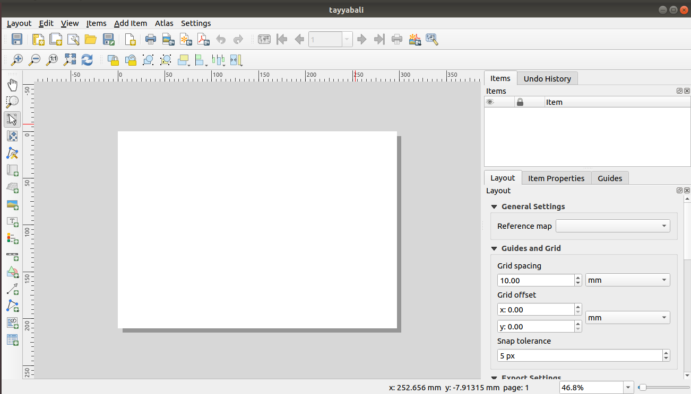
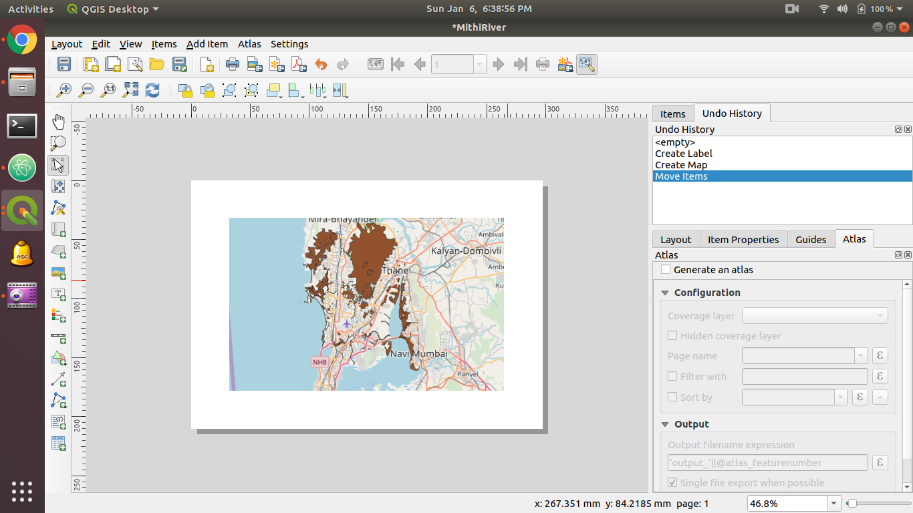

In this Post we will learn to use the QGIS print layout to create a basic map with all the required settings.

## Layout Manager

1. Go to `Project >> Layout Manager `

  

2. Create New Layout and click Ok It will look like following

  

3. You can now access layouts from, `Project >> Layouts `
4. Under `Layout` >> `Page Setup ` Set A4, Landscape and Set margins

  

5. Under Add Item, click in Add Map and Select the area on the layout to render the Map, you can Adjust the map in the page.

`Add Label` from the `Add Item` in the bottom of the page, and Change Items properties from right panel

6. Set Font Apperence, Alignment and Color

7. Add Legend Similarly and set its propertes, You can rename the layer names by double click on the layer name

8. Finally Export to Pdf from `Layout Menu `

File Looks like [riverexport.pdf](riverexport.pdf)
