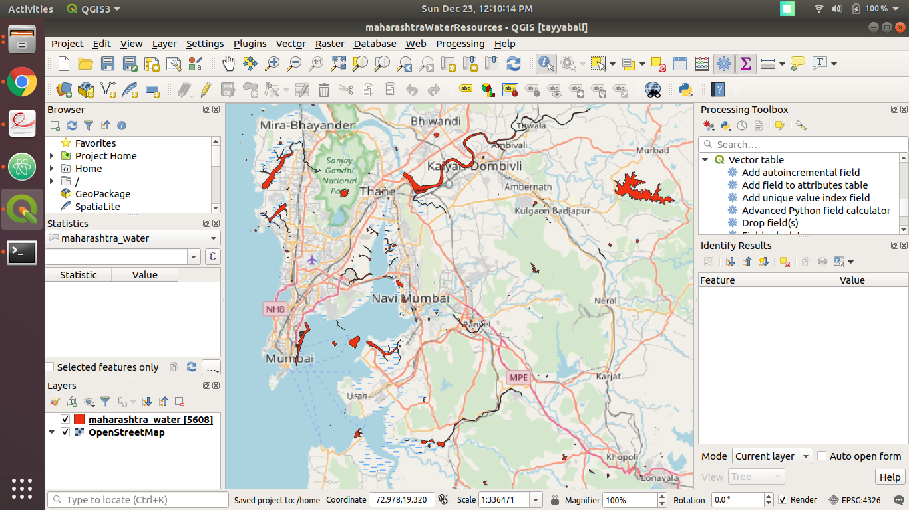
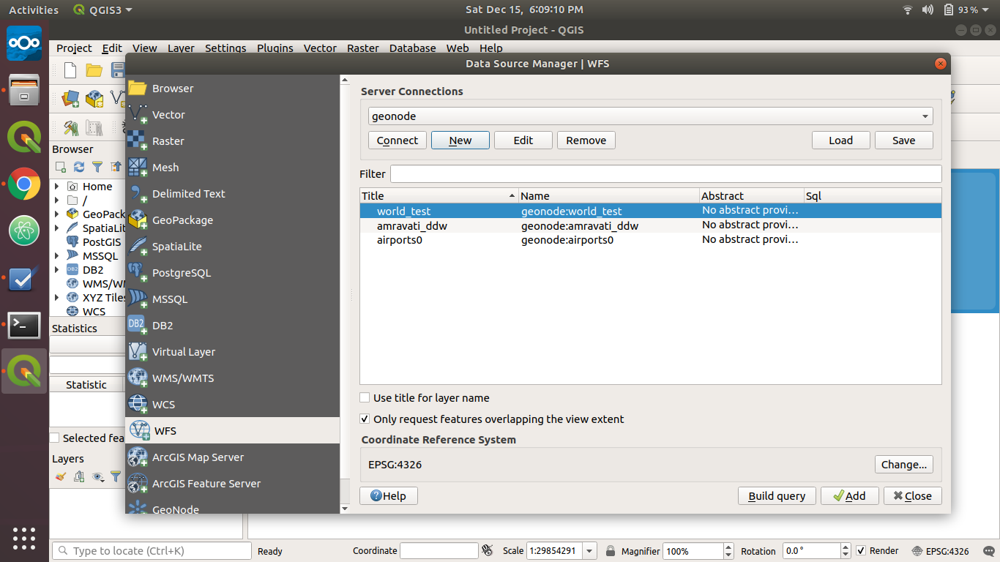
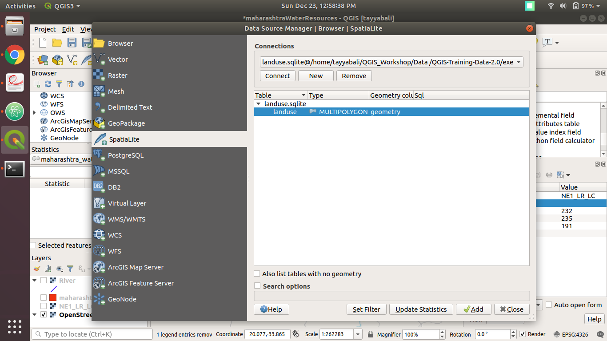

## Why QGIS?

+ It’s free and Open Source
+ It’s constantly developing
+ Help and documentation is available https://www.qgis.org/en/docs/index.html
+ Cross-platform

## 1. View and Explore Data

### 1.1 View Vector Data

It consists of points, lines, polygons shapes

Use `Layer >> Add Layer >> Add Vector Layer` to add Vector Layer

Data Source : https://mapcruzin.com/free-maharashtra-country-city-place-gis-shapefiles.htm

### 1.2 View Raster Data

It consists of a matrix of cells (or pixels) organized into rows and columns (or a grid) where each cell contains a value representing information

Use `Layer >> Add Layer >> Add Raster Layer` to add Raster Layer

Data Source : https://www.naturalearthdata.com/downloads/10m-raster-data/10m-natural-earth-1/

### 1.3 View Dada from A Web Map Service (WMS)

WMS is a standard protocol developed by the [Open Geospatial Consortium](http://www.opengeospatial.org/)

Following three images shows layers from the Geocode. GeoNode is a web-based application and platform for developing GIS system and for deploying spatial data infrastructures (SDI)

Use `Layer >> Data Source Manager >> WMS/WMTS >> New Connection >> Connect >> Select Layers` to add the WMS data

<b>Add Connection Details </b>
You can add the connect from http://159.65.146.249/geoserver/wms You don't need to login if the layer has is public access

<b>Select Layers </b>

<b> Later Added to the QGIS </b>

### 1.4 View Data from the SQLite

Use `Layer >> Data Source >> spatiaLight >> New >> Select Sqlight File >> Connect >> Add`

### 2. Compose/Create Map for Sharing/Printing

[DBIT Tree Plantation Program ](DBITLayout.pdf)

### 3. Create, Edit, Manage and Export Data
+ Editing tools for Vector and Raster data
+ Georeferencer to geocode images
+ GPS tools to import and export GPX format, and conversion tools
+ Visualizing and editing OpenStreetMap data
+ Create spatial database tables from files
+ Managing vector attribute tables

### 4. Analysis of the data
+ Vector analysis
+ Sampling
+ Geoprocessing
+ Geometry and database management tools

### 5. Publishing Maps on the Web
QGIS can be used as a client for

`WMS`: A Web Map Service is a standard protocol developed by the Open Geospatial Consortium in 1999 for serving georeferenced map images over the Internet

`WMTS`: A Web Map Tile Service is a standard protocol for serving pre-rendered or run-time computed georeferenced map tiles over the Internet

`WMS-C`: Web Mapping Service - Cached permits servers to optimize their image generation, and allows tiles to be cached at intermediate points. A WMS-C service would likely only deliver images for bounding boxes aligned to a given rectangular origin and grid, and only at particular scale levels.

`WFS`: Open Geospatial Consortium Web Feature Service (WFS) Interface Standard provides an interface allowing requests for geographical features across the web using platform-independent calls

`WFS-T client`: Web Feature Service (WFS) with transactions

`WMS, WCS or WFS server`: QGIS can be used as a server for WMS, WCS or WFS services

### 6. QGIS Plugins

You can create a new plugin or use existing developed by the community

### 6. QGIS Python console for scripting

